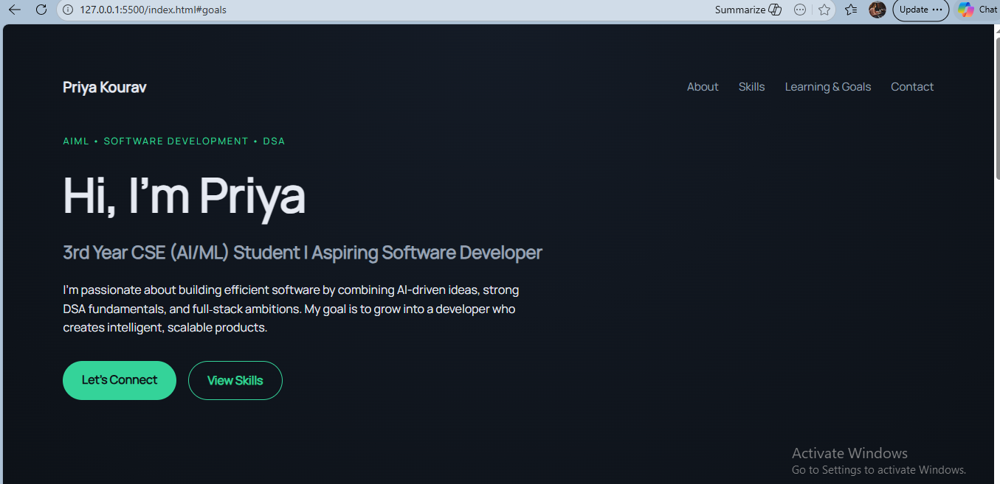
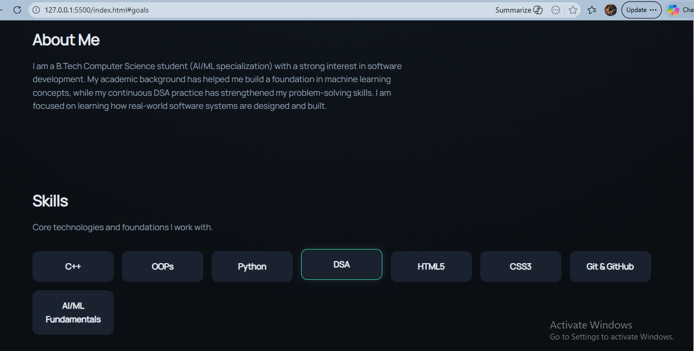
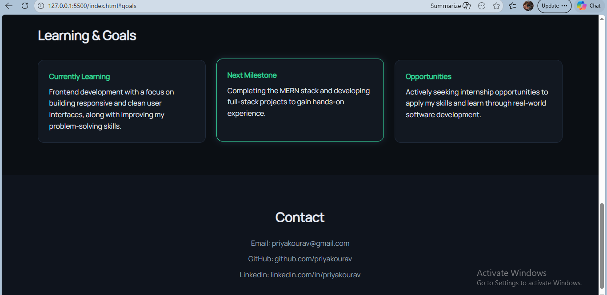
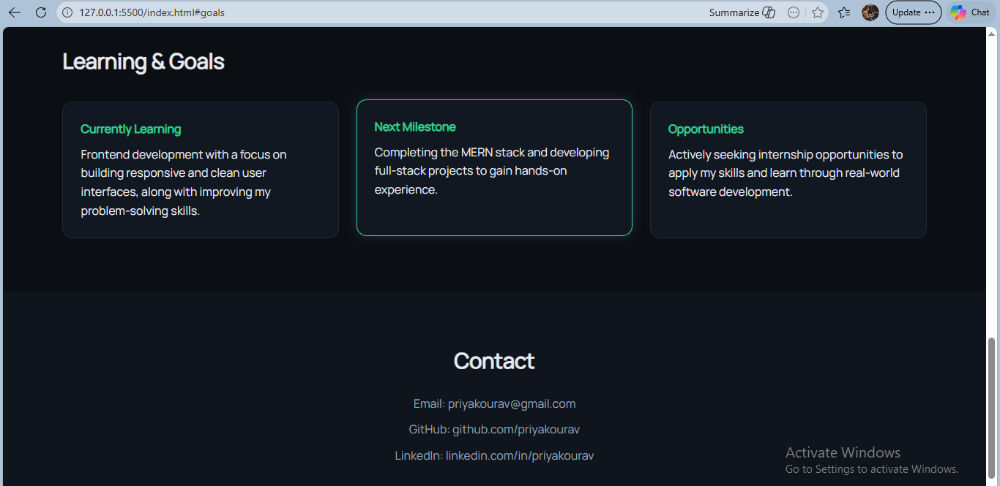

# PORTFOLIO

A modern, responsive developer portfolio built using **HTML and CSS**.

## Features
- Clean dark theme UI
- Responsive layout
- Modern CSS (Flexbox & Grid)
- Smooth hover interactions

##  Tech Stack
- HTML5
- CSS3

##  Live Demo
https://kourav0555.github.io/PORTFOLIO/

##  Preview

  
  

  
  

##  Purpose
This project showcases my frontend skills and serves as my personal portfolio.
