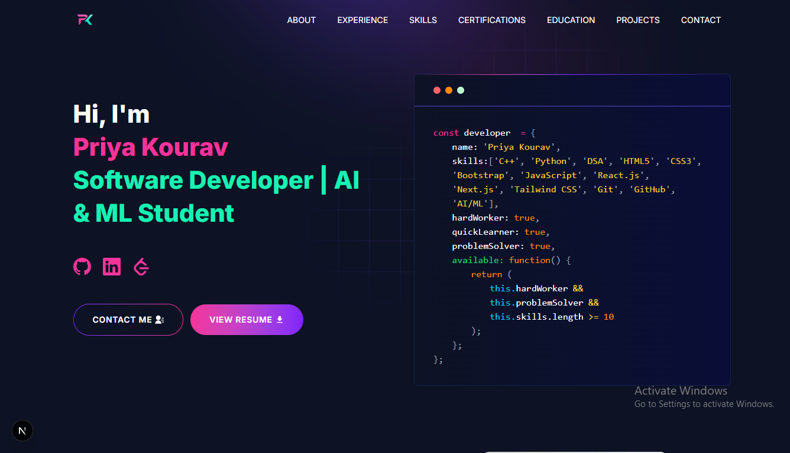

# Priya Kourav | Developer Portfolio

<p align="center">
  
</p>

<p align="center">
  
  
  
  

A personal developer portfolio showcasing my software development journey, projects, technical skills, certifications, and continuous learning in Full-Stack Development and Generative AI. Built with Next.js, React, and Tailwind CSS with a focus on performance, responsive design, and clean user experience.

## 🌐 Live Portfolio

**Portfolio:** https://YOUR-PORTFOLIO-LINK.vercel.app

---

## 👩‍💻 About Me

Hi, I'm **Priya Kourav**, a B.Tech student specializing in Artificial Intelligence & Machine Learning.

I'm passionate about building modern web applications, solving programming problems, and exploring Full-Stack Development, Artificial Intelligence, and Generative AI.

Currently I'm improving my skills in:

- MERN Stack Development
- Data Structures & Algorithms
- Generative AI
- AI Agents
- System Design Fundamentals

---

## ✨ Features

- Responsive design for all devices
- Modern UI built with Tailwind CSS
- Interactive animations
- Projects showcase
- Certifications section
- Experience timeline
- Contact form
- SEO optimized
- Fast performance using Next.js

---

## 🛠 Tech Stack

### Frontend

- Next.js
- React
- JavaScript
- HTML5
- CSS3
- Tailwind CSS

### Programming Languages

- C++
- Python
- JavaScript

### Tools

- Git
- GitHub
- VS Code
- Chart.js

---

## 🚀 Featured Projects

### Smart Expense Tracker

A responsive expense tracking application with intelligent expense categorization, interactive analytics, and local storage support.

**Tech Used**

- HTML
- CSS
- JavaScript
- Chart.js

---

### TaskFlow – Smart Task Management System

A modern task management application featuring drag-and-drop functionality, task prioritization, filtering, dark mode, and local storage.

**Tech Used**

- HTML
- CSS
- JavaScript

---

### Bank Management System

Console-based banking application developed using C++ and Object-Oriented Programming concepts.

**Tech Used**

- C++
- OOP

---

### Developer Portfolio

Personal portfolio website built using Next.js and Tailwind CSS showcasing projects, certifications, skills, and experience.

**Tech Used**

- Next.js
- React
- Tailwind CSS

---

## 🏆 Certifications

- Oracle Cloud Infrastructure 2025 Certified AI Foundations Associate
- Foundations in Generative AI – IBM SkillsBuild
- Scientific Computing with Python – freeCodeCamp
- Python (Basic) – HackerRank
- Problem Solving (Basic) – HackerRank
- Agentic AI Summer School – SAGE University
- C++ Development Internship – InternCareer
- DeepSeek AI: The Complete Guide to DeepSeek & 20+ AI Tools

---

## 📂 Project Structure

```text
app/
components/
assets/
public/
utils/
```

---

## ⚙️ Run Locally

Clone the repository

```bash
git clone https://github.com/priyakourav/PORTFOLIO.git
```

Go to project directory

```bash
cd PORTFOLIO
```

Install dependencies

```bash
npm install
```

Start development server

```bash
npm run dev
```

---

## 📫 Connect With Me

**LinkedIn**

https://www.linkedin.com/in/priyakourav

**GitHub**

https://github.com/priyakourav

**Email**

priyakourav55@gmail.com

---

## ⭐ If you like this portfolio

Consider giving the repository a ⭐ on GitHub.
